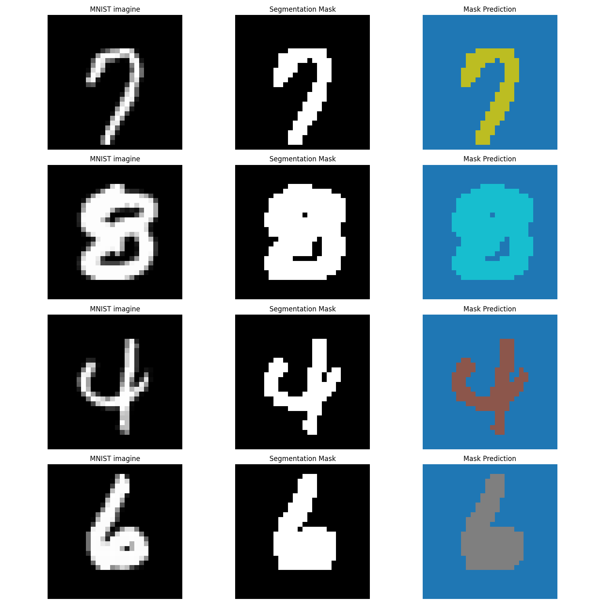

# Convolutional Neural Networks, FCN, RESNET

## Experiments  

1. **ResNetsvsCNN**  
   <span style="font-size:18px;">Why do ResNets leave traditional CNNs in the dust? In this exercise I look at how residual connections tackle the vanishing gradient problem and highlight some other properties through a comparison between CNN and RESNET on CIFAR10 dataset. 

2. **Fully Convolutionalize a Network for Digit Recognition**  
   <span style="font-size:18px;">Can a fully convolutional architecture effectively classify handwritten digits? This experiment builds an FCN, demonstrating its efficiency in digit recognition tasks.  

3. **Interpreting CNN decision – Grad-CAM in Action**  
   <span style="font-size:18px;">Neural networks are often seen as black boxes, but what if we could visualize their 'thought' process? This experiment brings interpretability to life using Grad-CAM to highlight the most important regions in an image that drive model predictions.

## Requirements  

- Python 3.x  
- PyTorch & Torchvision  
- Matplotlib (for visualization)  
- OpenCV (for Grad-CAM heatmaps)  

Install dependencies with:  

```bash
pip install torch torchvision matplotlib opencv-python
```

## **RESIDUAL CONNECTIONS**
 

<span style="font-size:18px;">The degradation problem occurs when very deep networks suffer from accuracy saturation or even degradation, meaning that adding more layers does not improve performance and can even make it worse. Residual connections address this issue by allowing the use of deeper networks. In the following, I compare a CNN and a ResNet both with 35 layers.
<br><br>

<br><br>

<div align="center">

<table style="width:60%; border-collapse: collapse;">
  <tr>
    <th style="border: 1px solid black; padding: 10px; font-size: 18px;">Models</th>
    <th style="border: 1px solid black; padding: 10px; font-size: 18px;">Plain</th>
    <th style="border: 1px solid black; padding: 10px; font-size: 18px;">ResNet</th>
  </tr>
  <tr>
    <td style="border: 1px solid black; padding: 10px; font-size: 18px;">Test Accuracy</td>
    <td style="border: 1px solid black; padding: 10px; font-size: 18px;">0.77</td>
    <td style="border: 1px solid black; padding: 10px; font-size: 18px;">0.85</td>
  </tr>
</table>

</div>


<br><br>

<span style="font-size:18px;">CNNs easily reach 80% accuracy (just take the model I trained in the Grad-CAM section, for example), but in this case, adding more layers led to the degradation issue. On the other hand, the ResNet model achieved 85% accuracy, demonstrating how residual connections can help avoid the degradation problem and allow for deeper, more efficient networks.

### **Why ResNets Outperform CNNs: A Gradient Comparison** 

<span style="font-size:18px;">One of the primary reasons **ResNets** outperform traditional **CNNs** is the use of **skip connections**, which help mitigate the **vanishing gradient problem**. To test the validity of this hypothesis, I compared two networks: a CNN and a ResNet, both with 35 layers, using the same architecture described in the original paper.

<span style="font-size:18px;">For each network, I selected one layer from the beginning and one from the end, then analyzed the **average gradient** with respect to the **weights** of those layers.  

<span style="font-size:18px;"> What I expected to observe was that the gradient for the **initial layers of the ResNet** would be significantly larger compared to the **CNN**. However, as you'll see, the results were not as anticipated.

<div style="display: flex; justify-content: space-between;">
  
  
</div>
<br><br>

<span style="font-size:18px;">As you can observe, the magnitudes of the gradients for both networks are comparable. In the case of the CNN, there is no sign of the vanishing gradient problem.  

<span style="font-size:18px;">The reason for this is quite simple. As highlighted in the original paper, the use of **Batch Normalization** and **ReLU activations** inherently ensures that both the **forward** and **backward** signals do not vanish.  
<br><br>
<span style="font-size:18px;">To further test the hypothesis that **skip connections** are effective against the vanishing gradient problem, I decided to induce the issue by removing all **Batch Normalization layers** and replacing the **ReLU activations** with **tanh activations** in the models.
<br><br>
<div style="display: flex; justify-content: space-between;">
  
  
</div>
<br><br>
<span style="font-size:18px;">The effect of <strong>residual connections is quite significant,  the gradients in both layers remain of the same order of magnitude.
I repeated the same experiment with two networks, each containing <strong>53 layers and obtained the same results. 
<br><br>
<div style="display: flex; justify-content: space-between;">
  
  
</div>
<br><br>
<span style="font-size:18px;">The results are summarized in the table below, where I calculated the <strong>average gradient</strong> over the 50 iterations.</span>
<br><br>

<div align="center">

<table style="width:60%; border-collapse: collapse;">
  <tr>
    <th style="border: 1px solid black; padding: 10px;">Models</th>
    <th style="border: 1px solid black; padding: 10px;">35 layers</th>
    <th style="border: 1px solid black; padding: 10px;">53 layers</th>
  </tr>
  <tr>
    <td style="border: 1px solid black; padding: 10px;">Plain</td>
    <td style="border: 1px solid black; padding: 10px;">2e-10</td>
    <td style="border: 1px solid black; padding: 10px;">6e-15</td>
  </tr>
  <tr>
    <td style="border: 1px solid black; padding: 10px;">ResNet</td>
    <td style="border: 1px solid black; padding: 10px;">0.03</td>
    <td style="border: 1px solid black; padding: 10px;">0.02</td>
  </tr>
</table>

</div>

### **Loss comparison**

<span style="font-size:18px;">When comparing the training loss, it is clear that the ResNet decreases more rapidly than the CNN, indicating that the residual connections allow for faster convergence and more efficient learning, even with deeper networks.
<br><br>

<br><br>

<span style="font-size:18px;">It is also interesting to note the behavior of the gradient norms and the standard deviation across the layers. As we can see, especially in the early iterations, the gradients of the plain network appear to be more noisy and bigger than those of the ResNet, which could partly explain the observed behavior of the training loss.
<br><br>
<div style="display: flex; justify-content: space-between;">
  
  
</div>
<br><br>

## Usage
There are two different scripts, ResidualConnection.py to confront magnitudes of two layers and gradient_magnitude.py to reproduce std and norm comparison.

### Running ResidualConnection
To run the ResidualConnection.py and analyze the gradient magnitude of different models, use the following command:

```bash
python ResidualConnection.py --model <MODEL_NAME>
```

### Available Models
You can choose from the following model names:

- `CNN35` – Standard CNN with 35 layers
- `Residual35` – ResNet with 35 layers
- `CNN53` – Standard CNN with 53 layers
- `Residual53` – ResNet with 53 layers
- `CNN_tanh35` – CNN with tanh activation (35 layers)
- `Residual_tanh35` – ResNet with tanh activation (35 layers)
- `CNN_tanh53` – CNN with tanh activation (53 layers)
- `Residual_tanh53` – ResNet with tanh activation (53 layers)
- `trained_CNN` – Pre-trained CNN model
- `Residual_trained` – Pre-trained ResNet model

### Output
The script will generate a plot of the gradient magnitude in the the two layers and save it in the `Ex1/Results_grad/` directory as `<MODEL_NAME>.png`.

### Running gradient_magitude
To execute the gradient_magitudes.py script, use the following command:

```bash
python gradient_magitudes.py --metric <norm|std>
```

### Arguments
- `--metric`: Specifies the gradient metric to compute. Options:
  - `norm`: Computes the gradient norm.
  - `std`: Computes the gradient standard deviation.


## **CNN NETWORK SURGERY**

<span style="font-size:18px;">In this exercise, I trained a simple CNN on MNIST and replaced the classification layer with a decoder composed of transposed and upsampling convolutions, and then trained it on segmented version of the training set. This transformation allows the network to associate every pixel of the image with its corresponding class, effectively highlighting the number. The encoder consists of the convolutional layers of the pre-trained CNN, as suggested in the original paper. For this task it wasn't necessary to employ skip connections.
Here, I present the results for some randomly selected images from the test set.
<br><br>

<br><br>

<span style="font-size:18px;">As an exercise, I implemented an adapted version of FCN-8 for this task, following the guidelines from the original paper. However, while the model is clearly able to identify the number, it seems to perform worse in the pixel classification task. This is likely due to the fact that the number of channels is reduced to 11(num classes) from the very first layer of the decoder. (See https://www.researchgate.net/figure/Fully-convolutional-neural-network-architecture-FCN-8_fig1_327521314 for a simple scheme )

<br><br>

<br><br>

<span style="font-size:18px;">Finally, I used the first model I trained to attempt recognizing and classifying multiple digits within the same image. It is interesting to note that, although its performance in the classification task(—likely because it was trained on the MNIST dataset images) is quite lacking, the model is still able to accurately identify the pixels belonging to a number.
<br><br>
<div style="display: flex; justify-content: space-between;">
  
  
</div>
<br><br>

## Usage
To run the fullyconv script, use the following command:

```bash
python fullyconv.py --model <MODEL_NAME> --mode <MODE> [--test_type <TEST_TYPE>]
```

### Arguments:
- `--model`: Choose the model to use. Options:
  - `standardFCN`
  - `fcn8`
- `--mode`: Select the mode. Options:
  - `train` → Trains the selected model
  - `test` → Tests the selected model
- `--test_type` (Required only if `--mode test` is selected):  
  - `grid` → Runs the test on a random grid with size 56x84
  - `SegmentedMNIST` → Runs the test on the SegmentedMNIST dataset

## **GRAD CAM**

<span style="font-size:18px;">Grad-CAM is a powerful technique for interpreting CNNs by highlighting the most important regions of an image for a given class. This helps to:  

- Understand the model’s decision-making process  
- Debug classification errors  
- Improve the transparency and explainability of neural networks  
<br><br>
<span style="font-size:18px;">In this exercise, I implemented the Grad-CAM method and applied it to an image from the 'cat' class in CIFAR-10 as an illustrative example.  
<br><br>

<br><br>
<span style="font-size:18px;">I used a CNN that achieved an accuracy score of 0.80 on the test set.When analyzing the model's behavior, we observe that the generated heatmap highlights the details of the animal's face, which the model uses to correctly identify the cat.

<br><br>
<div style="display: flex; justify-content: space-between;">
  
  
</div>
<br><br>

### **Again on ResNet**
<span style="font-size:18px;"> Finally, I applied Grad-CAM to the ResNet model as well. In this case, it's interesting to note that the resulting heatmap is more diffuse and focuses on additional details of the animal, such as the tail and paws. I interpreted this as an effect of the residual connections, which allow the image to flow through the layers, enabling the model to have a more general "vision" of the image.

<br><br>
<div style="display: flex; justify-content: space-between;">
  
  
</div>
<br><br>
